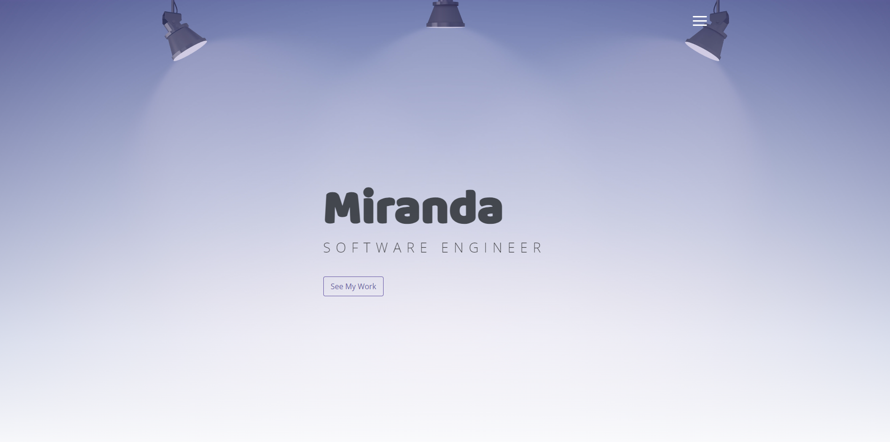

# Miranda Portfolio Website

This repository contains the HTML and CSS code for a personal portfolio website called "Miranda Portfolio". The website showcases the skills, projects, and contact information of Miranda, a Software Engineer based in New York.

## Table of Contents

- [Description](#description)
- [Features](#features)
- [Screenshots](#screenshots)
- [Usage](#usage)
- [Technologies](#technologies)
- [Contact](#contact)

## Description

The **Miranda Portfolio** website is designed to showcase Miranda's skills and projects as a Software Engineer. The website consists of several sections, including:

- **Home**: A landing page introducing the user to Miranda's portfolio.
- **About**: A section providing information about Miranda's background and skills.
- **Portfolio**: A collection of project showcases with images and descriptions.
- **Contact**: A contact form for users to get in touch with Miranda.
- **Footer**: Copyright information and social media links.

## Features

- Intuitive and responsive design for easy navigation across devices.
- Fast and dynamic user experience with lag-free interactions.
- A collection of showcased projects, demonstrating various skills.
- Contact form to enable users to send messages to Miranda.
- Links to Miranda's GitHub and LinkedIn profiles for professional networking.

## Screenshots

## Usage

To view the **Miranda Portfolio** website, simply open the `index.html` file in a web browser. You can navigate through the different sections using the navigation bar or by scrolling.

To interact with the contact form, fill in your name, email, and a message. Then click the "Message Me!" button to send a message to Miranda.

## Technologies

The website is built using the following technologies:

- Figma: [Miranda-Portfolio](https://www.figma.com/file/Gml0Hj08qSdvbv6fcJnr9W/Miranda-Portfolio?type=whiteboard&node-id=0%3A1&t=r5DJUL0QrGmPfqO7-1)
- Miro: [Miranda](https://miro.com/app/board/uXjVMti07F4=/?share_link_id=42389336594)
- HTML5
- CSS3 (including Bootstrap framework)
- JavaScript (jQuery library)

## Contact

If you would like to get in touch with Miranda or learn more about their projects, you can find them on GitHub and LinkedIn:

- GitHub: [MirandaMG20](https://github.com/MirandaMG20)
- LinkedIn: [M. G. Miranda](https://www.linkedin.com/in/m-g-miranda/)
- Netlify: [Miranda Portfolio](https://portfolio-miranda.netlify.app/#portfolio)
